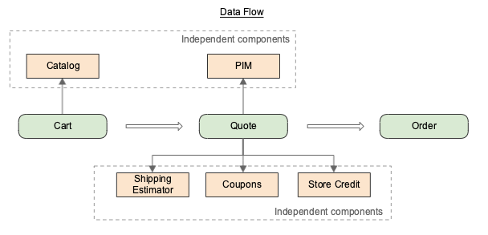
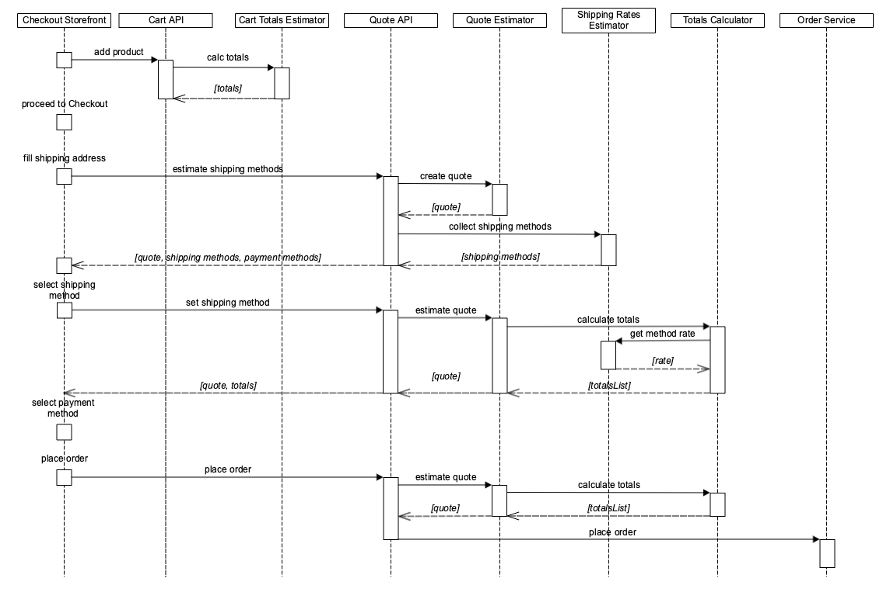
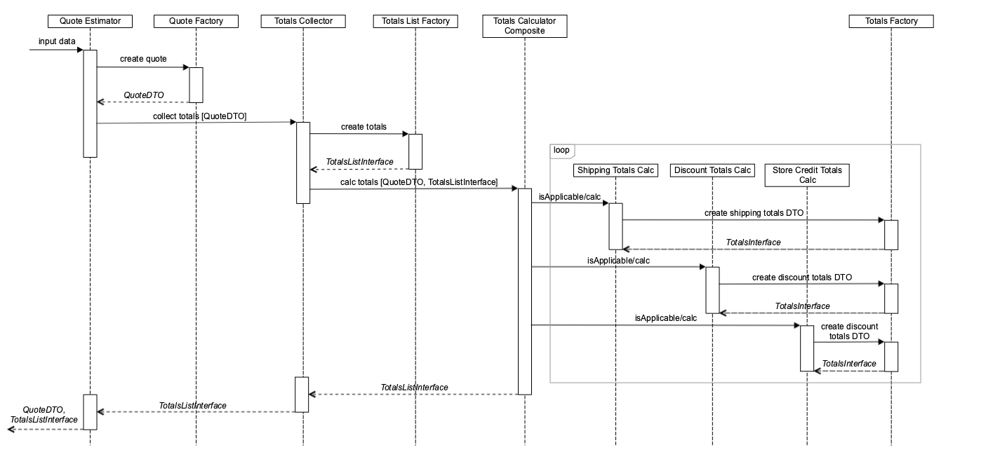
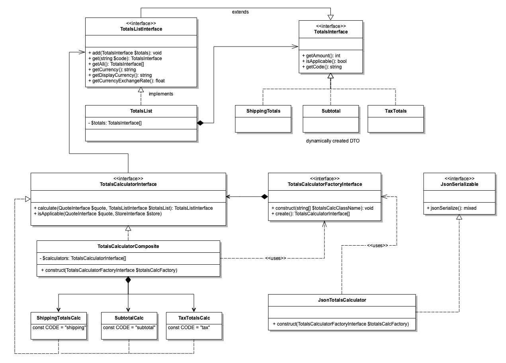
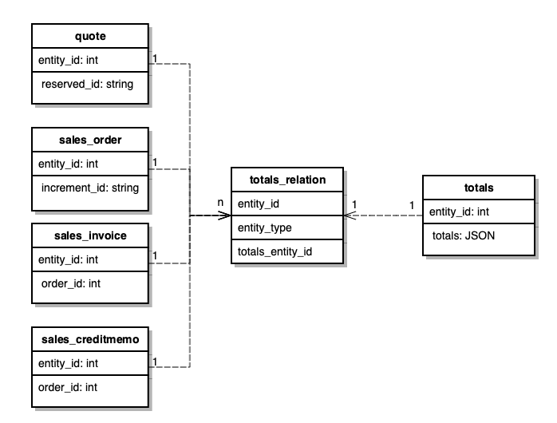
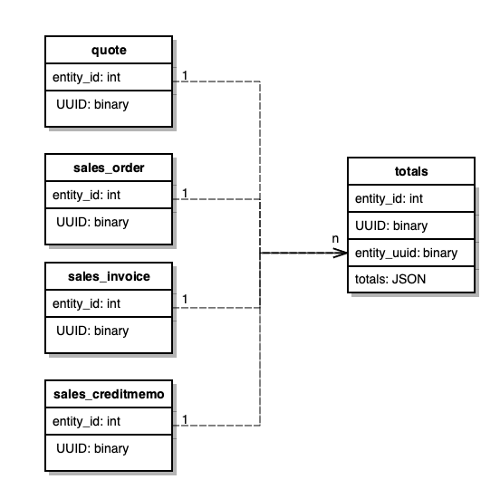

# Alternative checkout flow

In the scope of work on GraphQL and storefront APIs, we have an opportunity to improve the design and features of storefront checkout.

The purpose of this document is to discuss possible alternatives to current Magento checkout flow which might be introduced as an alternative API. 

The cart is just a container for the items the user wants to purchase. In the proposed flow the cart is created as soon as the user adds the product to cart. The data from the cart entity should be enough to render mini-cart and cart pages (with totals estimation). Taxes and other adjustments are not calculated at these steps.

The quote, on the other hand, contains a full break down of all adjustments calculated. It provides the user with the total he has to pay for the items in the cart.

It is possible to split cart items into separate quotes. This can be done based on shipping addresses or shipping sources.

Each quote is used to create a separate order, the quote will have time to live (TTL) based on different factors like coupon expiration time, stock availability, available store credit, etc. Multiple payment methods (with independent billing address each) can be selected during each order creation.

This proposal describes multiple approaches for the checkout flow.

## Current checkout flow

This section describes current checkout flow.


1. Products rendered from Catalog. An item is added to the cart.
2. The cart calls the catalog product’s repository to get product details.
3. The view cart action calls a totals collector to estimate totals on the quote.
4. “Proceed to Checkout” starts a one-page checkout flow, where a customer can specify shipping and billing addresses, choose a payment solution and place an order.
5. When the customer enters or selects the shipping address, shipping rates are estimated, which triggers whole totals calculation.
6. On the Select Payment Method step, the customer can specify a billing address, choose a payment method, and apply discounts and gift cards.
7. Actions like applying a customer balance, discounts, gift cards trigger the recalculation of the totals.
8. The payment review step also contains summary details like items, shipping method, totals.

Most of the actions like page reloading, retrieving shipping rates, applying discounts, gift cards, etc. triggers whole cart/quote recalculation.

The different quote's calculators, like Cart Price Rule calculator, change quote object and totals and behavior might be unpredictable as different calculators can operate with the same data.

## Uni-directional checkout flow

The flow assumes that each component like Cart, Quote, Shipping, etc. will receive all needed details to perform operations. This approach allows resolving and reducing a list of dependencies between modules.



The Cart will depend on Catalog. Quote will have a knowledge about PIM, Shipping Rates estimator, Coupons, Store Credit and other services for totals calculation. Cart will provide data for Quote. Quote will provide data for Order. Order will not have any knowledge about Catalog, Quote, Cart.


1. An item that contains all needed attributes (like SKU, quantity, regular price and options) is added to the cart.
2. The cart calls the totals estimator for basic items price calculation. This calculation is needed only for a summary representation in the shopping cart. It does not make sense to check prices from PIM or Catalog.
3. The “Proceed to Checkout” triggers the creation of a Quote entity. It does not contain an estimate of the totals. 
4. After the customer specifies a shipping method, the shipping rates estimator provides all available shipping methods for this address. If a customer wants to specify multiple shipping addresses, then multiple quotes will be created (one per shipping address) and a list of available shipping methods will be provided for all addresses.
5. On the select payment method step, a customer chooses the payment method, specifies a billing address while Magento applies discounts and gift cards, calculates customer balance, etc.
6. After a payment method is chosen and all possible price adjustments are specified, the summary can be reloaded dynamically based on changes for each item.
7. The summary block includes quote items, shipping addresses and other quote/multi-quote details.
8. The change of any or all price adjustments triggers a new quote creation and totals recalculation.
9. The Quotes Estimator triggers totals calculation. Each calculator gets all the needed data, like the actual shipping rate, product prices, tax rules, the current state of customer balance, etc.

The `Quotes Estimator` will be the main entry point to create a quote based on the provided input and the `Totals Collector` will provide totals calculation based on the provided quote object and the configuration. The `Shipping Rates Estimator` will be agnostic to the quote object and will provide shipping rates based on input data like shipping origin, shipping destination, items dimensions. The unified input data would allow using the same `Shipping Rates Estimator` for RMA, order estimated delivery, etc. Also, the estimator will support rates retrieving only for a specific shipping method to reduce a number of calls to other shipping carriers (the current implementation gets rates from all configured carriers).

The following sequence diagram shows how the place order will look like according to the proposed solution:



The [GraphQL](https://graphql.org/learn/queries/) allows combining multiple queries/mutations in the same HTTP request which reduce the number of communications between client and backed applications. According to the proposed flow, the requests like getting available shipping and payment methods in some cases can be merged into a single request. Also, depending on how the checkout flow is built, requests to select a shipping method, payment, applying a discount, customer balance can be combined, which allows to do not re-calculate quote totals for each operation and do it only once for final input data.

## Data Flow

  1. When Quote is created?
     * When a customer clicks `Proceed to Checkout`
  2. Cart properties:
     * Line Items:
       * SKU
       * Selected options (custom/configurable)
       * Quantity
       * Regular price
       * Price
  3. Quote factory arguments: Quote
     * !Line Items
     * Dimensions (weight & size) (based on LineItems)
     * Shipping (requited for physical products)
       * Address
       * Selected Shipping Method
     * Billing address (required for virtual products). Need use cases
     * Coupons
     * Gift cards
     * Store credit
     * Cart rules (calculated by Applicable catalog rules calculator)
     * Customer
  4. Totals calculator: Totals
     * QuoteArgumentDTO
     * PreviousTotals
  5. Quote
     * Line Items
        * Dimensions
     * Shipping address
     * Price Adjustments
        * Line Items Totals
            * Totals
            * Adjustments
                * Taxes
                * Cart rule discounts
        * Coupons
        * Gift cards
        * Store credit
        * Taxes
     * Customer
  6. Place Order: Order
     * Quote
     * PaymentMethod with Billing Addresses

## Quote creation flow

A quote should be created from Cart after a customer clicks `Proceed to Checkout`, on the API level it will be a separate service contract like `QuoteEstimator::create`. After the quote is created, it became an immutable object and only totals can be recalculated (the totals will be represented as a separate object). If a list of items should be changed, when a new quote object should be created. Quote will live until TTL expires or an order is successfully placed.


## Totals calculation improvements

The current approach for quote calculation has multiple drawbacks like changes in the quote object, a quote totals collector is difficult to customize, a complicated logic to define the order of totals calculation (tax before/after discount, discount/tax rules for shipping, etc.), additional calls to 3rd party systems for shipping rate prices updating.

The proposed solution assumes that a quote will be an immutable object and will operate with totals list, each calculator will create add new totals object based on totals list and the order of each calculation can be changed in runtime. As one of the benefits of the proposed approached - the list of calculators and their order can be visualized for better calculation understanding.

Let's consider the calculation of the totals might look like.


Each calculator receives Quote DTO and Totals List, calculates totals, creates new Totals DTO with the calculated amount and adds it to Totals List. This approach allows to do not change a quote object, have a defined interface for totals and change the order of calculation. Magento provides multiple configurations to change the order of calculation, for example, discount can be applied before shipping amount or after.


As the list of calculators and their order depend not only on configuration but also on such factors like a presence of shipping address (gift cards, virtual, downloadable products do not require shipping address) the calculations pipeline should be built-in runtime.



And the following UML class diagram represents needed classes and interfaces.



All client code will work with totals via `TotalsListInterface`, which will contain all calculated totals, also it provides a possibility to get all totals as list of objects.

All totals will be persisted as JSON structure into the database which allows having dynamic totals structure for different entities like quote, order, invoice, credit memo without increasing the list of database columns. For example, the current `quote` database table contains 28 fields related to different types of totals like price with/without tax, used customer balance, amounts with/without base currency, etc. The new structure would allow to store all totals in one field. The currency exchange rate will be stored instead of duplication of amounts for base and display currencies. As all calculations are happen only in base currency, the display currency is used for amount representation on storefront.

The example of totals presentation:

```json
{
   "amount":1002,
   "currency":"USD",
   "display_currency":"EUR",
   "currency_exchange_rate":0.92,
   "is_applicable":true,
   "code":"totals_list",
   "totals":[
      {
         "code":"subtotal",
         "amount":902,
         "is_applicable":true
      },
      {
         "code":"shipping",
         "amount":100,
         "is_applicable":true
      },
      {
         "code":"discount",
         "amount":0,
         "is_applicable":false
      },
      {
         "code":"grand_total",
         "amount":1002,
         "is_applicable":true
      }
   ]
}
```

The next schema represents relations between totals and other entities like quote, order, invoice, credit memo.



The usage of UUID would allow removing dependency to the entity type and make entity/totals storage more agnostic.



### Totals Calculation Priority

The current implementation of totals calculation allows to specify the priority of calculators execution:
- 100 Subtotal
- 190 Gift Wrapping
- 200 Subtotal Tax
- 225 Weee (FPT)
- 300 Discount
- 350 Shipping
- 375 Shipping Tax
- 400 Shipping Discount
- 425 Gift Wrapping Tax
- 450 Tax
- 460 Weee (FPT) Tax
- 475 Gift Wrapping After Tax
- 550 Grand Total
- 700 Gift Card Account
- 750 Customer Balance
- 1000 Reward

The last three calculators `Gift Card Account`, `Customer Balance`, `Reward` have incorrect priority because they adjust `Grand Total` which should be last in the list.

### Data for calculation

A quote has multiple parts of totals which should recalculated each time like:

 - Discount - includes expiration time, availability, reservation0
 - Store Credit - includes balance availability
 - Shipping rate price - actual price for a product delivery
 - Gift Card - includes expiration time, number of usages and balance availability
 
There is still an open question if catalog prices should be re-calculated for an active quote.

In the scope of Services Isolation project, the calculation of the totals can be implemented as a separate service.

## Use cases

The proposed solution must be verified against use cases described in [this document](alternative-checkout-flow/use-cases.md).

## Open questions

The current implementation assumes that quote should be recalculated on any change like cart price rule, gift card, etc. Also, the quote is recalculated before place order and each calculator makes additional communication to other components like Catalog, Shipping Carrier to get the latest updates.

There are still open questions related to the proposed solutions:

 - When and which data should be validated (coupons expiration, store credit/rewards points availability, gift card balance, actual shipping rates)?
 - Do we guarantee that product prices in the quote always actual during quote TTL?
 - How the reservation mechanism should be implemented (a customer wants to apply the coupon code/store credit/rewards balance for multiple quotes)?
 - Should quote TTL be fixed or dynamically calculated in runtime?
 - Do we want to have only one `Add to Cart` entry-point for multiple product types?
 - Should shipping address be a part of the Cart? (No)
 - Should we migrate to integer representation of amounts to avoid one-cent issues and support zero-decimal currencies out-of-box?
 - The current shopping cart contains actions which do not belong to it like shipping estimation, coupon and gift cards.
 - Do we want to use some kind of signature for quote and totals to do not re-calculate totals on every page loading?

## Summary

The main benefits of the proposed changes are the following:

 - Clear boundaries between Cart and Quote components
 - Multi-address checkout out-of-box
 - Support of immutable multi-quote flow
 - Unified interface via `ToalsListInterface` for totals calculation
 - One-directional flow allows reducing communication between components
 - Possibility to separate quotes based on stock availability
 - Improving API customizability and extensibility
 - Performance improvements based on reducing dependencies between components and their communication
 - Simplified and unified totals storage
